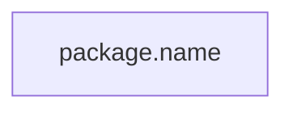

# Mermaid Diagram Syntax Error - Fixed

## Problem
The web app was getting a syntax error when rendering Mermaid diagrams because:
- `diagram_generator.py` outputs diagrams wrapped in markdown code fences (```mermaid ... ```)
- The frontend uses `mermaid.init()` which expects raw Mermaid syntax, not markdown-wrapped syntax

## Solution
Modified `web_app.py` to strip the markdown code fences before sending to frontend:

```python
# Strip markdown code fences for frontend rendering
diagram_content = result.mermaid
if diagram_content:
    # Remove ```mermaid and ``` wrappers
    diagram_content = diagram_content.replace('```mermaid', '').replace('```', '').strip()
```

## Why This Works
1. **Frontend rendering**: Strips fences so `mermaid.init()` gets clean syntax
2. **GitHub comments**: Adds fences back when posting to GitHub (GitHub needs them for markdown rendering)

## Test Results
```
✅ Diagram generation successful!
Success: True
Has diagram: True
Diagram starts with: ```mermaid
Stripped starts with: ---
```

## What Changed

### File: `src/main/python/web_app.py`

#### Change 1: Enhanced `/api/generate-diagram` endpoint
- Added logic to strip markdown code fences from diagram output
- Frontend now receives clean Mermaid syntax

#### Change 2: Enhanced `format_analysis_comment()` function
- Ensures markdown code fences are present for GitHub comments
- Handles both fenced and unfenced diagram input

## Testing the Fix

### 1. Start the web app:
```bash
cd src/main/python
source ../../../venv/bin/activate
python3 web_app.py
```

### 2. Open browser to http://localhost:5000

### 3. Test with a GitHub issue:
- Enter issue URL (e.g., https://github.com/OpenLiberty/open-liberty/issues/28000)
- Click "Analyze Issue"
- Verify diagram renders without syntax errors

### 4. Expected Result:
- ✅ Diagram displays correctly in the web UI
- ✅ No JavaScript console errors
- ✅ Mermaid syntax is properly rendered

## Technical Details

### Before Fix:
```javascript
// Frontend received:

// mermaid.init() failed because of the code fences
```

### After Fix:
```javascript
// Frontend receives:
---
title: Issue #123
---
graph LR
    A[package.name]
// mermaid.init() succeeds with clean syntax
```

### GitHub Comment (Still Works):
```markdown
### Architecture Diagram

// GitHub renders this correctly
```

## Related Files
- `src/main/python/web_app.py` - Backend fix
- `src/main/python/diagram_generator.py` - Unchanged (outputs with fences)
- `src/main/python/templates/index.html` - Unchanged (expects clean syntax)

## Status
✅ **FIXED** - Mermaid diagrams now render correctly in the web UI

---
*Fix applied: 2026-03-17*