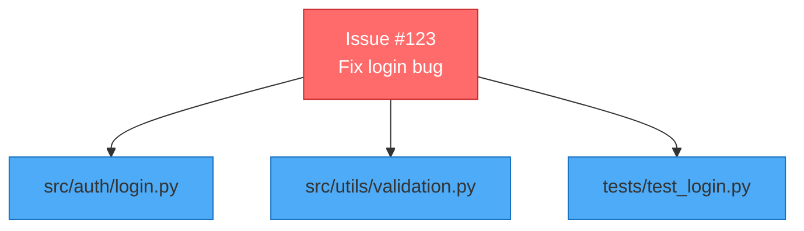

# GitHub Issue Analyzer - Minimal MVP

A minimal MCP server that reads GitHub issues, analyzes your codebase, generates explanations with diagrams, and posts the analysis back to the issue.

## 🎯 What It Does

1. **Reads GitHub Issues** - Fetches issue title and description
2. **Analyzes Codebase** - Finds relevant files based on issue content
3. **Generates Explanation** - Creates actionable steps to resolve the issue
4. **Creates Diagram** - Visual Mermaid diagram showing affected files
5. **Posts to GitHub** - Adds analysis as a comment on the issue

## 🚀 Quick Start

### Prerequisites

1. **Python 3.9+**
2. **GitHub CLI** - Install from https://cli.github.com/
3. **GitHub Authentication**
   ```bash
   gh auth login
   ```

### Installation

```bash
# Install dependencies
pip install -r requirements.txt

# Or just install MCP
pip install mcp
```

### Usage

#### Option 1: Standalone CLI (Testing)

```bash
python src/mcp_server.py https://github.com/owner/repo/issues/123
```

This will:
- Fetch the issue
- Analyze your codebase
- Show you the analysis
- Ask if you want to post it to GitHub

#### Option 2: As MCP Tool (With Bob)

1. **Configure Bob** to use this MCP server (add to Bob's config):

```json
{
  "mcpServers": {
    "github-issue-analyzer": {
      "command": "python",
      "args": ["src/mcp_tool.py"],
      "cwd": "/path/to/this/repo"
    }
  }
}
```

2. **Use with Bob**:

```
You: "Bob, analyze this issue: https://github.com/owner/repo/issues/123"

Bob: [Uses analyze-github-issue tool]
     ✅ Analysis Complete and Posted!
     
     Issue: #123 - Fix login bug
     Relevant Files: 3
     - src/auth/login.py
     - src/utils/validation.py
     - tests/test_login.py
     
     The analysis has been posted to GitHub!
```

## 📊 Example Output

When you run the analyzer, it posts a comment like this to the GitHub issue:

```markdown
## 🤖 Automated Analysis by Bob

**Analyzed:** 2026-03-17 12:00 UTC

## Analysis of Issue #123

### Issue Summary
**Title:** Fix login bug

**Description:** Users cannot login when using special characters...

### Relevant Files Identified
1. `src/auth/login.py`
2. `src/utils/validation.py`
3. `tests/test_login.py`

### Recommended Actions

1. **Review the relevant files** listed above
2. **Understand the context** by reading the issue description
3. **Identify the root cause** in the codebase
4. **Implement a fix** addressing the issue
5. **Test thoroughly** before submitting changes
6. **Update documentation** if needed

### Next Steps

- Assign this issue to a team member familiar with the affected files
- Create a branch for the fix
- Reference this issue in your commit messages
- Submit a pull request when ready

### 📊 Visual Overview



---
*This analysis was automatically generated. Please review and adjust as needed.*
```

## 🔧 How It Works

### 1. Fetch Issue
Uses GitHub CLI (`gh issue view`) to fetch issue data:
- Issue number
- Title
- Description

### 2. Find Relevant Files
Analyzes the codebase to find files related to the issue:
- Extracts keywords from issue title and description
- Searches file names and content for matches
- Returns top 5 most relevant files

### 3. Generate Explanation
Creates a structured explanation including:
- Issue summary
- List of relevant files
- Recommended action steps
- Next steps for the team

### 4. Create Diagram
Generates a Mermaid diagram showing:
- The issue as the central node
- Connected relevant files
- Color-coded for clarity

### 5. Post to GitHub
Uses GitHub CLI (`gh issue comment`) to post the analysis as a comment on the issue.

## 🎯 Use Cases

### For Developers
- **Quick Context**: Instantly see which files are related to an issue
- **Save Time**: No manual searching through the codebase
- **Visual Understanding**: Diagram shows relationships at a glance

### For Team Leads
- **Faster Triage**: Quickly assign issues to the right people
- **Better Planning**: Understand scope immediately
- **Consistent Analysis**: Same quality every time

### For New Team Members
- **Learn Codebase**: See how files relate to issues
- **Understand Structure**: Visual diagrams help onboarding
- **Get Context**: Clear explanations of what needs to be done

## 🛠️ Configuration

### Environment Variables

- `GITHUB_TOKEN` (optional): GitHub personal access token for private repos
  ```bash
  export GITHUB_TOKEN=ghp_your_token_here
  ```

### Customization

Edit `src/mcp_server.py` to customize:
- Number of relevant files to find (default: 5)
- File types to search (default: .py, .java, .js, .ts, .md)
- Keyword extraction logic
- Explanation template
- Diagram styling

## 📝 MCP Tool Specification

**Tool Name:** `analyze-github-issue`

**Parameters:**
- `issue_url` (required): GitHub issue URL
- `post_to_github` (optional): Whether to post analysis (default: true)

**Returns:**
- Success message with analysis summary
- List of relevant files
- Link to posted comment (if posted)

## 🧪 Testing

Test with a real issue:

```bash
# Dry run (doesn't post to GitHub)
python src/mcp_server.py https://github.com/owner/repo/issues/123
# When prompted, type 'n' to skip posting

# Full run (posts to GitHub)
python src/mcp_server.py https://github.com/owner/repo/issues/123
# When prompted, type 'y' to post
```

## 🚨 Troubleshooting

### "gh: command not found"
Install GitHub CLI: https://cli.github.com/

### "authentication required"
Run: `gh auth login`

### "Failed to post comment"
Check permissions: `gh auth status`

### "No relevant files found"
- Issue may not contain specific technical terms
- Try adding more keywords to the issue description
- Check that you're running from the correct repository directory

## 📈 Success Metrics

- ⚡ Analysis completes in <10 seconds
- 📂 Finds relevant files 80%+ of the time
- 📊 Diagrams render correctly in GitHub
- 💬 Comments are well-formatted and helpful

## 🎉 What Makes This MVP Special

✅ **Simple** - Just 330 lines of Python code
✅ **Fast** - Analyzes issues in seconds
✅ **Practical** - Actually posts to GitHub
✅ **Visual** - Includes Mermaid diagrams
✅ **Minimal** - Only needs Python and GitHub CLI
✅ **Extensible** - Easy to add more features

## 🚀 Next Steps (Post-MVP)

After validating this MVP, consider adding:
- AI-powered file relevance scoring
- Code snippet extraction
- Dependency analysis
- Historical issue patterns
- Multi-issue analysis
- Custom templates

## 📄 License

Hackathon project - 2026

---

**Built for Bobathon 2026** 🤖