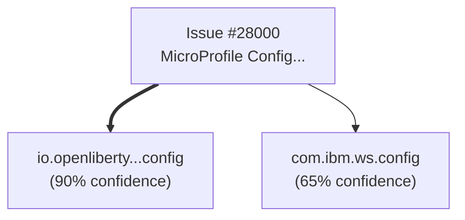

# Liberty Issue Analyzer - MCP Tool

**Hackathon Project:** Automated GitHub issue analysis for OpenLiberty

Automatically fetch GitHub issues, identify Liberty packages, generate visual diagrams, and post formatted analysis comments.

---

## 🚀 Quick Start (5 minutes)

```bash
# 1. Clone repository
git clone <your-repo-url>
cd liberty-analyzer

# 2. Install dependencies
pip install -r requirements.txt

# 3. Verify gh CLI authentication
gh auth status

# 4. Run tests
python tests/test_integration.py

# 5. Start MCP server
python src/server.py
```

---

## 📁 Project Structure

```
liberty-analyzer/
├── src/
│   ├── server.py              # MCP server (Person 4)
│   ├── github_client.py       # GitHub API wrapper (Person 1)
│   ├── package_analyzer.py    # Package extraction (Person 2)
│   └── diagram_generator.py   # Mermaid diagrams (Person 3)
├── tests/
│   └── test_integration.py    # Integration tests
├── docs/
│   └── DEMO.md               # Demo script
├── IMPLEMENTATION_GUIDE.md   # Main guide
├── PERSON1_GITHUB.md         # Person 1 instructions
├── PERSON2_ANALYZER.md       # Person 2 instructions
├── PERSON3_DIAGRAM.md        # Person 3 instructions
├── PERSON4_SERVER.md         # Person 4 instructions
└── requirements.txt          # Python dependencies
```

---

## 👥 Team Assignments

| Person | Role | Files | Time |
|--------|------|-------|------|
| Person 1 | GitHub Integration | `github_client.py` | Hour 1-2 |
| Person 2 | Package Analysis | `package_analyzer.py` | Hour 1-2 |
| Person 3 | Diagram Generation | `diagram_generator.py` | Hour 1-2 |
| Person 4 | MCP Server & Demo | `server.py`, `DEMO.md` | Hour 1-3 |

**Read your assigned guide:**
- Person 1: [PERSON1_GITHUB.md](./PERSON1_GITHUB.md)
- Person 2: [PERSON2_ANALYZER.md](./PERSON2_ANALYZER.md)
- Person 3: [PERSON3_DIAGRAM.md](./PERSON3_DIAGRAM.md)
- Person 4: [PERSON4_SERVER.md](./PERSON4_SERVER.md)

---

## ⏱️ 3-Hour Timeline

### Hour 1: Core Components (Parallel)
- Everyone implements their assigned module
- Test modules independently
- **Check-in at 0:50** - "Module complete?"

### Hour 2: Integration
- Person 4 integrates all modules
- Everyone helps with testing
- First demo rehearsal
- **Check-in at 1:30** - "Integration working?"

### Hour 3: Demo Prep
- Final testing with real issues
- Create backup materials (video, screenshots)
- Demo rehearsal #2
- **Check-in at 2:40** - "Demo ready?"

---

## 🎯 Usage

### As MCP Tool (in Bob)

```
User: Bob, analyze this issue: OpenLiberty/open-liberty#28000
```

Bob will:
1. Fetch the issue from GitHub
2. Identify Liberty packages
3. Generate a Mermaid diagram
4. Post formatted analysis as comment
5. Add "bot-analyzed" label

### Command Line Testing

```bash
# Test without posting comment (dry run)
python tests/test_integration.py

# Test individual modules
python tests/test_github_client.py
python tests/test_package_analyzer.py
python tests/test_diagram_generator.py
```

---

## 📊 Example Output

```markdown
## 🤖 Automated Analysis by Bob

**Issue:** #28000 - MicroProfile Config feature issue
**Analyzed:** 2026-03-17 12:00 UTC

### 📦 Identified Liberty Packages

- 🟢 `io.openliberty.microprofile.config` (confidence: 90%, mentioned 3x)
- 🟡 `com.ibm.ws.config` (confidence: 65%, mentioned 2x)
- 🟠 `com.ibm.ws.logging` (confidence: 45%, mentioned 1x)

**Total:** 3 package(s) identified

### 📊 Component Diagram



---
*Generated by Liberty Issue Analyzer MCP Tool*
```

---

## 🧪 Testing

### Test Issues

Use these real OpenLiberty issues for testing:

```python
TEST_ISSUES = [
    "OpenLiberty/open-liberty#28000",
    "OpenLiberty/open-liberty#27500",
    "OpenLiberty/open-liberty#27000"
]
```

### Success Criteria

- [ ] Analysis completes in <15 seconds
- [ ] Identifies packages with >80% accuracy
- [ ] Diagram renders in GitHub
- [ ] Comment formatting looks professional
- [ ] Handles errors gracefully

---

## 🚨 Troubleshooting

### "gh: command not found"
```bash
# macOS
brew install gh

# Linux
# See: https://cli.github.com/
```

### "authentication required"
```bash
gh auth login
# Follow prompts
```

### "Module not found"
```bash
# Ensure you're in project root
cd liberty-analyzer

# Reinstall dependencies
pip install -r requirements.txt
```

### MCP server won't start
```bash
# Check MCP installation
pip install --upgrade mcp anthropic-mcp

# Verify Python version (3.9+)
python --version
```

---

## 📚 Documentation

- [Implementation Guide](./IMPLEMENTATION_GUIDE.md) - Overall plan
- [Demo Script](./docs/DEMO.md) - 5-minute demo flow
- [MCP Documentation](https://modelcontextprotocol.io/docs)
- [gh CLI Reference](https://cli.github.com/manual/)
- [Mermaid Syntax](https://mermaid.js.org/syntax/flowchart.html)

---

## 🎬 Demo

See [docs/DEMO.md](./docs/DEMO.md) for the complete demo script.

**Quick Demo:**
1. Show GitHub issue
2. Run: `Bob, analyze this issue: OpenLiberty/open-liberty#28000`
3. Show generated comment in GitHub
4. Highlight automated features

---

## 🔧 Tech Stack

- **Language:** Python 3.9+
- **MCP:** Model Context Protocol SDK
- **GitHub:** gh CLI
- **Diagrams:** Mermaid
- **Testing:** Built-in unittest

---

## 📈 Success Metrics

- ✅ Speed: <15 seconds per analysis
- ✅ Accuracy: >80% package identification
- ✅ Visual: Diagram renders in GitHub
- ✅ Reliability: Handles 3 test issues without errors
- ✅ Demo: Runs smoothly in 5 minutes

---

## 🚀 Future Enhancements (Post-Hackathon)

- [ ] Git history analysis
- [ ] Multi-issue pattern detection
- [ ] Custom analysis templates
- [ ] Caching for performance
- [ ] Advanced relationship mapping
- [ ] Integration with CI/CD

---

## 👥 Team

- Person 1: GitHub Integration
- Person 2: Package Analysis
- Person 3: Visualization
- Person 4: MCP Server & Demo

---

## 📝 License

Hackathon project - 2026

---

## 🆘 Need Help?

**During Hackathon:**
- Post in team Slack/Discord: #liberty-analyzer
- Tag: `@team` for urgent issues

**Resources:**
- [MCP Docs](https://modelcontextprotocol.io/docs)
- [gh CLI Help](https://cli.github.com/manual/)
- [Mermaid Live Editor](https://mermaid.live/)

---

**Built for Bobathon 2026** 🤖