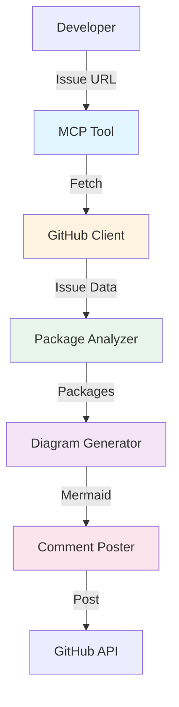
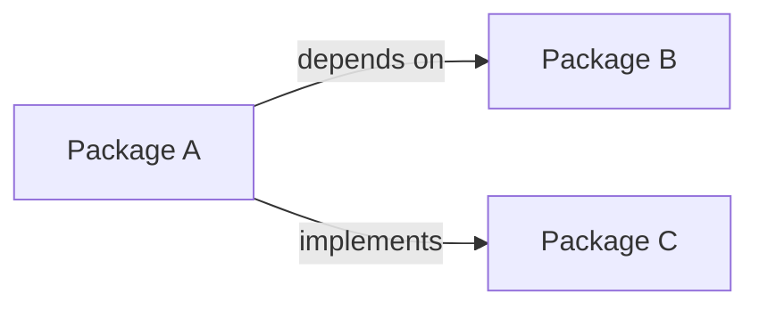

# System Architecture Overview

## High-Level Architecture



## Component Overview

### 1. MCP Tool (Orchestrator)
**Purpose**: Single entry point that orchestrates the entire workflow

**Responsibilities**:
- Accept issue URL from user
- Coordinate workflow steps
- Handle errors at each stage
- Provide progress feedback
- Return final status

**Key Methods**:
```java
public class MCPTool {
    public AnalysisResult analyzeIssue(String issueUrl);
    private void validateUrl(String url);
    private void logProgress(String message);
}
```

---

### 2. GitHub Client
**Purpose**: Interface with GitHub REST API

**Responsibilities**:
- Authenticate with GitHub token
- Fetch issue details (title, description, labels)
- Handle rate limiting
- Manage API errors
- Cache responses (optional)

**Key Methods**:
```java
public class GitHubClient {
    public Issue fetchIssue(String issueUrl);
    public void postComment(String issueUrl, String comment);
    public void addLabel(String issueUrl, String label);
    private String authenticate();
}
```

**API Endpoints Used**:
- `GET /repos/{owner}/{repo}/issues/{number}`
- `POST /repos/{owner}/{repo}/issues/{number}/comments`
- `POST /repos/{owner}/{repo}/issues/{number}/labels`

---

### 3. Package Analyzer
**Purpose**: Extract and identify Liberty packages from issue text

**Responsibilities**:
- Parse issue description
- Apply regex patterns for package names
- Calculate confidence scores
- Handle edge cases (no packages found)
- Return structured package data

**Key Methods**:
```java
public class PackageAnalyzer {
    public List<Package> analyzePackages(String issueText);
    private List<String> extractPackageNames(String text);
    private double calculateConfidence(String packageName, String context);
}
```

**Regex Patterns**:
```java
private static final Pattern LIBERTY_PACKAGE = 
    Pattern.compile("io\\.openliberty\\.[a-z0-9.]+");
private static final Pattern IBM_PACKAGE = 
    Pattern.compile("com\\.ibm\\.ws\\.[a-z0-9.]+");
```

---

### 4. Diagram Generator
**Purpose**: Create Mermaid component diagrams

**Responsibilities**:
- Generate Mermaid syntax from package list
- Determine component relationships
- Limit diagram complexity (max 5 components)
- Validate Mermaid syntax
- Format for GitHub markdown

**Key Methods**:
```java
public class DiagramGenerator {
    public String generateDiagram(List<Package> packages);
    private String createMermaidSyntax(List<Package> packages);
    private List<Relationship> inferRelationships(List<Package> packages);
    private boolean validateSyntax(String mermaid);
}
```

**Mermaid Template**:


---

### 5. Comment Poster
**Purpose**: Post formatted analysis back to GitHub

**Responsibilities**:
- Format analysis as markdown
- Include diagram and package list
- Post comment to issue
- Add labels
- Handle posting errors
- Update existing comments if re-run

**Key Methods**:
```java
public class CommentPoster {
    public void postAnalysis(String issueUrl, AnalysisResult result);
    private String formatComment(AnalysisResult result);
    private void handlePostError(Exception e);
}
```

**Comment Template**:
```markdown
## 🤖 Automated Analysis by Bob

**Issue**: #12345 - NullPointerException in JWT token validation

**Identified Packages** (2):
- `io.openliberty.security.jwt` (confidence: 95%)
- `com.ibm.ws.security.token` (confidence: 87%)

**Architecture Diagram**:
[Mermaid diagram here]

---
*Analysis generated at: 2026-03-17 12:00:00 UTC*
*Version: 1.0.0*
```

---

## Data Flow

### 1. Input Phase
```
User provides: https://github.com/OpenLiberty/open-liberty/issues/12345
↓
MCP Tool validates URL format
↓
GitHub Client authenticates
```

### 2. Fetch Phase
```
GitHub Client fetches issue data
↓
Returns Issue object:
{
  number: 12345,
  title: "NullPointerException in JWT token validation",
  body: "When validating JWT tokens in io.openliberty.security.jwt...",
  labels: ["bug", "security"]
}
```

### 3. Analysis Phase
```
Package Analyzer processes issue body
↓
Applies regex patterns
↓
Returns Package list:
[
  { name: "io.openliberty.security.jwt", confidence: 0.95 },
  { name: "com.ibm.ws.security.token", confidence: 0.87 }
]
```

### 4. Diagram Phase
```
Diagram Generator receives packages
↓
Infers relationships
↓
Generates Mermaid syntax:
"graph LR\n  A[jwt] -->|uses| B[token]"
```

### 5. Output Phase
```
Comment Poster formats result
↓
Posts to GitHub
↓
Returns success/failure status
```

---

## Data Models

### Issue
```java
public class Issue {
    private int number;
    private String title;
    private String body;
    private List<String> labels;
    private String url;
    private Date createdAt;
}
```

### Package
```java
public class Package {
    private String name;
    private double confidence;
    private String context;  // Surrounding text
    private PackageType type;  // LIBERTY, IBM, UNKNOWN
}
```

### AnalysisResult
```java
public class AnalysisResult {
    private Issue issue;
    private List<Package> packages;
    private String diagram;
    private long durationMs;
    private boolean success;
    private String errorMessage;
}
```

### Relationship
```java
public class Relationship {
    private Package source;
    private Package target;
    private RelationType type;  // DEPENDS_ON, IMPLEMENTS, USES
}
```

---

## Error Handling Strategy

### Error Categories

**1. Input Errors**
- Invalid URL format
- Inaccessible issue (404)
- Authentication failure

**Response**: Return clear error message, don't crash

**2. API Errors**
- Rate limit exceeded
- Network timeout
- GitHub API down

**Response**: Retry once, then fail gracefully with cached data if available

**3. Processing Errors**
- No packages found
- Mermaid syntax invalid
- Diagram too complex

**Response**: Return partial results with explanation

**4. Output Errors**
- Comment posting fails
- Label addition fails
- Permission denied

**Response**: Log error, return analysis without posting

### Error Response Format
```java
public class ErrorResponse {
    private String errorCode;
    private String message;
    private String suggestion;
    private AnalysisResult partialResult;  // If available
}
```

---

## Performance Considerations

### Target Metrics
- **Total Time**: < 15 seconds
- **GitHub API**: < 2 seconds per call
- **Package Analysis**: < 1 second
- **Diagram Generation**: < 1 second
- **Comment Posting**: < 2 seconds

### Optimization Strategies

**1. Parallel Processing**
```java
// Fetch issue and prepare templates in parallel
CompletableFuture<Issue> issueFuture = 
    CompletableFuture.supplyAsync(() -> githubClient.fetchIssue(url));
CompletableFuture<Template> templateFuture = 
    CompletableFuture.supplyAsync(() -> loadTemplate());
```

**2. Caching**
```java
// Cache issue data for 5 minutes
private Cache<String, Issue> issueCache = 
    CacheBuilder.newBuilder()
        .expireAfterWrite(5, TimeUnit.MINUTES)
        .build();
```

**3. Connection Pooling**
```java
// Reuse HTTP connections
private OkHttpClient client = new OkHttpClient.Builder()
    .connectionPool(new ConnectionPool(5, 5, TimeUnit.MINUTES))
    .build();
```

---

## Security Considerations

### Authentication
- GitHub token stored in environment variable
- Never log or expose token
- Use token with minimal required permissions

### Input Validation
- Validate URL format before API calls
- Sanitize issue text before regex processing
- Limit input size to prevent DoS

### Output Sanitization
- Escape markdown special characters
- Validate Mermaid syntax before posting
- Limit comment size

---

## Testing Strategy

### Unit Tests
- Test each component independently
- Mock external dependencies
- Cover edge cases

### Integration Tests
- Test complete workflow
- Use test GitHub repository
- Verify end-to-end functionality

### Performance Tests
- Measure execution time
- Test with various issue sizes
- Verify rate limit handling

---

## Deployment Architecture

```
Developer Machine
├── Bob MCP Server
│   └── GitHub Issue Analyzer Tool
│       ├── GitHubClient
│       ├── PackageAnalyzer
│       ├── DiagramGenerator
│       └── CommentPoster
└── Environment Variables
    └── GITHUB_TOKEN
```

---

## Future Enhancements

### Phase 2 (Post-Hackathon)
- Deep package structure analysis
- Git history mining for relationships
- Confidence score improvements
- Custom diagram templates

### Phase 3 (Production)
- Multi-issue pattern analysis
- Machine learning for package identification
- Advanced caching strategies
- Performance monitoring

---

## Technology Stack

| Component | Technology | Rationale |
|-----------|-----------|-----------|
| Language | Java 11+ | Liberty ecosystem alignment |
| HTTP Client | OkHttp | Robust, well-tested |
| JSON Parsing | Jackson | Fast, flexible |
| Testing | JUnit 5 | Industry standard |
| Build | Gradle | Modern, flexible |
| CI/CD | GitHub Actions | Native integration |

---

## Metrics & Monitoring

### Key Metrics
- Analysis success rate
- Average execution time
- Package identification accuracy
- API error rate
- User satisfaction

### Logging
```java
logger.info("Analysis started for issue #{}", issueNumber);
logger.debug("Found {} packages", packages.size());
logger.error("Failed to post comment: {}", error.getMessage());
```

---

## Conclusion

This architecture provides:
- ✅ Clear separation of concerns
- ✅ Testable components
- ✅ Robust error handling
- ✅ Performance optimization
- ✅ Future extensibility

The modular design allows each team member to work independently while maintaining clear interfaces between components.