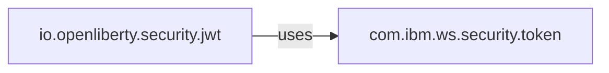
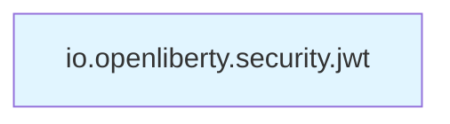
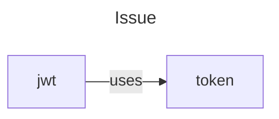
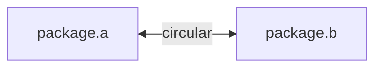
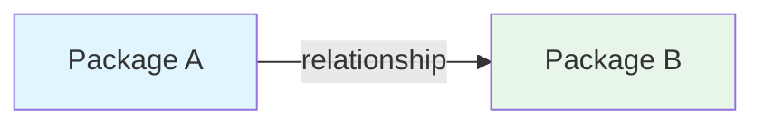
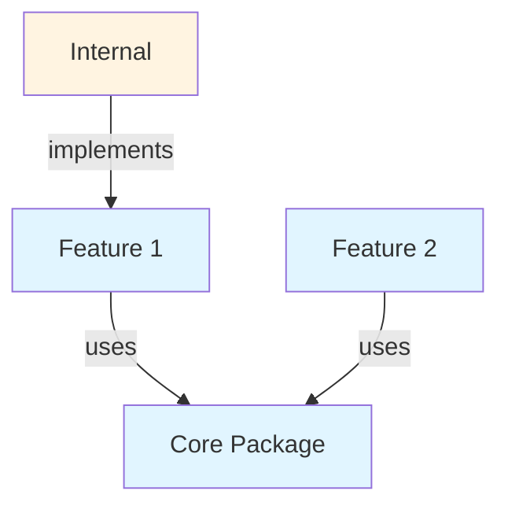
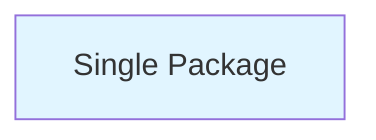
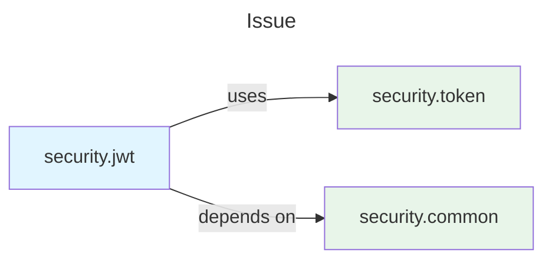
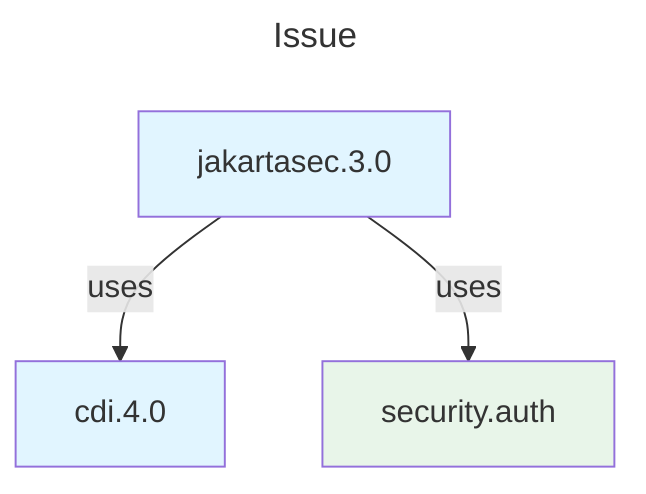

# User Story 2: Generate Simple Component Diagram

## Story Details

**ID**: US-002  
**Title**: Create basic Mermaid diagram showing package relationships  
**Priority**: P0 (Critical)  
**Estimate**: 1 hour  
**Assigned To**: Developer 2 (Integration Lead)

---

## User Story

**As a** developer investigating an issue  
**I need to** see a visual diagram of identified packages  
**So that** I can understand component relationships at a glance without reading code

---

## Acceptance Criteria

### AC1: Diagram Generation
**Given** a list of identified packages  
**When** the system generates a diagram  
**Then** the system creates valid Mermaid syntax that renders in GitHub markdown

**Example Input**:
```java
List<Package> packages = [
    Package("io.openliberty.security.jwt", 0.95),
    Package("com.ibm.ws.security.token", 0.87)
]
```

**Example Output**:


### AC2: Package Limit
**Given** more than 5 packages are identified  
**When** the system generates a diagram  
**Then** the system:
- Shows the top 5 packages by confidence score
- Includes a note: "Showing top 5 of X packages"
- Lists remaining packages in text format below diagram

**Example**:
```
Diagram shows top 5 packages.
Additional packages identified:
- io.openliberty.config (confidence: 75%)
- com.ibm.ws.logging (confidence: 68%)
```

### AC3: Relationship Inference
**Given** multiple packages from the same subsystem  
**When** the system infers relationships  
**Then** the system applies these rules:

| Pattern | Relationship | Example |
|---------|--------------|---------|
| `*.internal` depends on public API | depends-on | `jwt.internal` → `jwt` |
| `*.impl` implements interface | implements | `cdi.impl` → `cdi` |
| Security packages use auth | uses | `jwt` → `authentication` |
| Feature packages use core | uses | `jakartasec` → `security` |

### AC4: Single Package Handling
**Given** only one package is identified  
**When** the system generates a diagram  
**Then** the system creates a simple diagram showing the standalone component

**Example**:


### AC5: No Packages Handling
**Given** no packages are identified  
**When** the system attempts to generate a diagram  
**Then** the system returns a text message instead:
```
No packages identified for diagram generation.
Please ensure the issue description mentions Liberty package names.
```

### AC6: Diagram Title
**Given** an issue number and title  
**When** the system generates a diagram  
**Then** the diagram includes a descriptive title

**Example**:


### AC7: Syntax Validation
**Given** generated Mermaid syntax  
**When** the system validates the output  
**Then** the system ensures:
- Valid Mermaid graph syntax
- No special characters that break rendering
- Proper node and edge definitions
- Maximum 50 lines of Mermaid code

### AC8: Circular Dependencies
**Given** packages with circular dependencies  
**When** the system generates relationships  
**Then** the system shows bidirectional arrows

**Example**:


### AC9: Package Name Abbreviation
**Given** long package names (>30 characters)  
**When** the system creates diagram nodes  
**Then** the system abbreviates while keeping clarity

**Example**:
```
Full: io.openliberty.security.jakartasec.3.0.internal
Abbreviated: jakartasec.3.0.internal
```

### AC10: Styling
**Given** different package types  
**When** the system generates the diagram  
**Then** the system applies visual styling:
- Liberty packages: Blue background
- IBM packages: Green background
- Internal packages: Dashed border

---

## Technical Implementation

### Components to Implement

1. **DiagramGenerator.java**
   ```java
   public class DiagramGenerator {
       private static final int MAX_PACKAGES = 5;
       private static final int MAX_LINES = 50;
       
       public String generateDiagram(List<Package> packages, Issue issue);
       private String createMermaidSyntax(List<Package> packages);
       private List<Relationship> inferRelationships(List<Package> packages);
       private boolean validateSyntax(String mermaid);
       private String abbreviatePackageName(String fullName);
   }
   ```

2. **RelationshipMapper.java**
   ```java
   public class RelationshipMapper {
       public List<Relationship> mapRelationships(List<Package> packages);
       private RelationType inferType(Package source, Package target);
       private boolean isInternalPackage(String packageName);
       private boolean isImplementation(String packageName);
   }
   ```

3. **Data Models**
   ```java
   public class Relationship {
       private Package source;
       private Package target;
       private RelationType type; // DEPENDS_ON, IMPLEMENTS, USES
       private String label;
   }
   
   public enum RelationType {
       DEPENDS_ON("depends on"),
       IMPLEMENTS("implements"),
       USES("uses"),
       CIRCULAR("circular");
   }
   ```

---

## Test Cases

### Test Case 1: Two Packages with Relationship
```java
@Test
void testGenerateDiagram_TwoPackages_ShowsRelationship() {
    List<Package> packages = Arrays.asList(
        new Package("io.openliberty.security.jwt", 0.95),
        new Package("com.ibm.ws.security.token", 0.87)
    );
    
    String diagram = generator.generateDiagram(packages, issue);
    
    assertTrue(diagram.contains("graph LR"));
    assertTrue(diagram.contains("jwt"));
    assertTrue(diagram.contains("token"));
    assertTrue(diagram.contains("-->"));
}
```

### Test Case 2: Single Package
```java
@Test
void testGenerateDiagram_SinglePackage_ShowsStandalone() {
    List<Package> packages = Arrays.asList(
        new Package("io.openliberty.security.jwt", 0.95)
    );
    
    String diagram = generator.generateDiagram(packages, issue);
    
    assertTrue(diagram.contains("graph LR"));
    assertTrue(diagram.contains("jwt"));
    assertFalse(diagram.contains("-->"));
}
```

### Test Case 3: No Packages
```java
@Test
void testGenerateDiagram_NoPackages_ReturnsMessage() {
    List<Package> packages = Collections.emptyList();
    
    String result = generator.generateDiagram(packages, issue);
    
    assertTrue(result.contains("No packages identified"));
    assertFalse(result.contains("graph LR"));
}
```

### Test Case 4: More Than 5 Packages
```java
@Test
void testGenerateDiagram_MoreThan5Packages_ShowsTop5() {
    List<Package> packages = createPackageList(7); // 7 packages
    
    String diagram = generator.generateDiagram(packages, issue);
    
    assertTrue(diagram.contains("Showing top 5 of 7 packages"));
    // Count nodes in diagram
    long nodeCount = diagram.lines()
        .filter(line -> line.contains("[") && line.contains("]"))
        .count();
    assertEquals(5, nodeCount);
}
```

### Test Case 5: Internal Package Relationship
```java
@Test
void testInferRelationships_InternalPackage_DependsOnPublic() {
    List<Package> packages = Arrays.asList(
        new Package("io.openliberty.security.jwt.internal", 0.95),
        new Package("io.openliberty.security.jwt", 0.90)
    );
    
    List<Relationship> relationships = mapper.mapRelationships(packages);
    
    assertEquals(1, relationships.size());
    assertEquals(RelationType.DEPENDS_ON, relationships.get(0).getType());
}
```

### Test Case 6: Syntax Validation
```java
@Test
void testValidateSyntax_ValidMermaid_ReturnsTrue() {
    String validMermaid = "graph LR\n    A[pkg1] --> B[pkg2]";
    
    assertTrue(generator.validateSyntax(validMermaid));
}

@Test
void testValidateSyntax_InvalidMermaid_ReturnsFalse() {
    String invalidMermaid = "graph LR\n    A[pkg1] -> B[pkg2]"; // Wrong arrow
    
    assertFalse(generator.validateSyntax(invalidMermaid));
}
```

### Test Case 7: Package Name Abbreviation
```java
@Test
void testAbbreviatePackageName_LongName_Abbreviates() {
    String longName = "io.openliberty.security.jakartasec.3.0.internal";
    
    String abbreviated = generator.abbreviatePackageName(longName);
    
    assertTrue(abbreviated.length() < 30);
    assertTrue(abbreviated.contains("jakartasec"));
}
```

### Test Case 8: Circular Dependency
```java
@Test
void testInferRelationships_CircularDependency_ShowsBidirectional() {
    List<Package> packages = Arrays.asList(
        new Package("io.openliberty.cdi", 0.95),
        new Package("io.openliberty.security", 0.90)
    );
    // Assume both reference each other
    
    List<Relationship> relationships = mapper.mapRelationships(packages);
    
    assertTrue(relationships.stream()
        .anyMatch(r -> r.getType() == RelationType.CIRCULAR));
}
```

---

## Edge Cases

| Scenario | Expected Behavior |
|----------|-------------------|
| Package name with special chars | Escape or replace special characters |
| Very long package names | Abbreviate to max 30 characters |
| Identical package names | Add version suffix to differentiate |
| No clear relationships | Show packages as separate nodes |
| Complex dependency graph | Simplify to show only direct relationships |
| Mermaid syntax error | Fall back to text list of packages |
| Diagram exceeds 50 lines | Truncate and add "See full analysis" note |

---

## Mermaid Templates

### Template 1: Simple Two-Node


### Template 2: Multiple Nodes


### Template 3: Standalone


---

## Definition of Done

- [ ] DiagramGenerator implemented and tested
- [ ] RelationshipMapper implemented and tested
- [ ] All acceptance criteria met
- [ ] Unit tests passing (>80% coverage)
- [ ] Mermaid syntax validates correctly
- [ ] Diagrams render properly in GitHub
- [ ] Edge cases handled gracefully
- [ ] Performance target met (<1 second)
- [ ] Code reviewed and approved
- [ ] Documentation updated

---

## Dependencies

- Story 1 (US-001) must be complete
- Mermaid syntax knowledge
- Understanding of Liberty package structure

---

## Demo Scenario

```
User: "Bob, analyze issue #23456"

Bob: "Fetching issue #23456..."
     "Identified 3 Liberty packages..."
     "Generating architecture diagram..."
     
     [Displays Mermaid diagram showing:]
     - io.openliberty.security.jakartasec
     - io.openliberty.cdi
     - com.ibm.ws.security.authentication
     
     [With relationships:]
     - jakartasec depends on cdi
     - jakartasec uses authentication
     
     "Diagram generated successfully!"
```

---

## Visual Examples

### Example 1: JWT Issue


### Example 2: CDI Integration


---

## Notes

- Keep diagrams simple and readable
- Prioritize clarity over completeness
- Test rendering in GitHub markdown preview
- Have fallback to text list if diagram fails
- Consider color-blind friendly colors