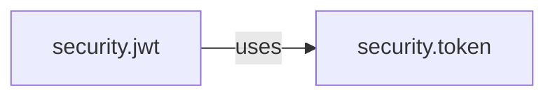

# User Story 3: Post Analysis as GitHub Comment

## Story Details

**ID**: US-003  
**Title**: Publish formatted analysis as issue comment  
**Priority**: P0 (Critical)  
**Estimate**: 1 hour  
**Assigned To**: Developer 3 (Testing Lead)

---

## User Story

**As a** developer  
**I need to** have the analysis automatically posted to the GitHub issue  
**So that** the entire team can see the context without running tools manually

---

## Acceptance Criteria

### AC1: Comment Formatting
**Given** analysis results (packages and diagram)  
**When** the system formats the comment  
**Then** the comment includes:
- Clear header: "🤖 Automated Analysis by Bob"
- Issue summary (number and title)
- List of identified packages with confidence scores
- Mermaid diagram (if packages found)
- Timestamp
- Analysis version

**Example**:
```markdown
## 🤖 Automated Analysis by Bob

**Issue**: #12345 - NullPointerException in JWT token validation

### Identified Packages (2)
- `io.openliberty.security.jwt` (confidence: 95%)
- `com.ibm.ws.security.token` (confidence: 87%)

### Architecture Diagram
[Mermaid diagram here]

---
*Analysis generated at: 2026-03-17 12:00:00 UTC*  
*Version: 1.0.0*
```

### AC2: Comment Posting
**Given** a formatted comment and issue URL  
**When** the system posts the comment  
**Then** the comment appears on the GitHub issue within 5 seconds

**Given** the comment is successfully posted  
**When** the operation completes  
**Then** the system returns the comment URL

### AC3: Label Management
**Given** a successful analysis  
**When** the system posts the comment  
**Then** the system adds the label "bot-analyzed" to the issue

**Given** the label doesn't exist in the repository  
**When** the system attempts to add it  
**Then** the system creates the label first, then applies it

### AC4: Update Existing Comment
**Given** the issue was previously analyzed  
**When** the system runs analysis again  
**Then** the system:
- Finds the existing Bob comment
- Updates it with new analysis
- Adds note: "Updated: [timestamp]"

**Example**:
```markdown
## 🤖 Automated Analysis by Bob

[Analysis content]

---
*Originally posted: 2026-03-17 10:00:00 UTC*  
*Updated: 2026-03-17 12:00:00 UTC*  
*Version: 1.0.0*
```

### AC5: Permission Handling
**Given** the user lacks permission to comment  
**When** the system attempts to post  
**Then** the system:
- Returns error: "Permission denied: Cannot post comments to this issue"
- Does not crash
- Logs the error with details

### AC6: Locked Issue Handling
**Given** the issue is locked  
**When** the system attempts to post  
**Then** the system:
- Returns error: "Issue is locked and cannot accept comments"
- Suggests: "Contact repository maintainer to unlock"
- Does not crash

### AC7: Size Limit Handling
**Given** the formatted comment exceeds GitHub's size limit (65,536 characters)  
**When** the system prepares to post  
**Then** the system:
- Truncates the diagram or package list
- Adds note: "Full analysis truncated. See [link] for complete results"
- Posts the truncated version

### AC8: Network Failure Handling
**Given** a network failure occurs during posting  
**When** the system attempts to post  
**Then** the system:
- Retries once after 2 seconds
- If retry fails, returns error with details
- Does not lose the analysis results

### AC9: Markdown Escaping
**Given** package names or text contain markdown special characters  
**When** the system formats the comment  
**Then** the system properly escapes:
- Backticks in code blocks
- Asterisks and underscores
- Square brackets and parentheses
- HTML tags

### AC10: Multiple Analyses
**Given** multiple users analyze the same issue simultaneously  
**When** both try to post comments  
**Then** the system:
- Handles race conditions gracefully
- Both comments post successfully (or second updates first)
- No data corruption occurs

---

## Technical Implementation

### Components to Implement

1. **CommentPoster.java**
   ```java
   public class CommentPoster {
       private final GitHubClient githubClient;
       private final CommentFormatter formatter;
       
       public CommentResult postAnalysis(String issueUrl, AnalysisResult result);
       public void addLabel(String issueUrl, String label);
       private Comment findExistingComment(String issueUrl);
       private void updateComment(String commentId, String content);
       private void handlePostError(Exception e);
   }
   ```

2. **CommentFormatter.java**
   ```java
   public class CommentFormatter {
       private static final int MAX_COMMENT_SIZE = 65536;
       
       public String formatComment(AnalysisResult result);
       private String escapeMarkdown(String text);
       private String truncateIfNeeded(String content);
       private String createHeader(Issue issue);
       private String createPackageList(List<Package> packages);
       private String createFooter();
   }
   ```

3. **Data Models**
   ```java
   public class CommentResult {
       private boolean success;
       private String commentUrl;
       private String errorMessage;
       private long postTimeMs;
   }
   
   public class Comment {
       private String id;
       private String body;
       private String url;
       private Date createdAt;
       private Date updatedAt;
       private String author;
   }
   ```

---

## Test Cases

### Test Case 1: Successful Comment Post
```java
@Test
void testPostAnalysis_Success_ReturnsCommentUrl() {
    AnalysisResult result = createAnalysisResult();
    
    CommentResult commentResult = poster.postAnalysis(issueUrl, result);
    
    assertTrue(commentResult.isSuccess());
    assertNotNull(commentResult.getCommentUrl());
    assertTrue(commentResult.getCommentUrl().contains("/issues/12345#"));
}
```

### Test Case 2: Comment Formatting
```java
@Test
void testFormatComment_ValidResult_ContainsAllSections() {
    AnalysisResult result = createAnalysisResult();
    
    String comment = formatter.formatComment(result);
    
    assertTrue(comment.contains("🤖 Automated Analysis by Bob"));
    assertTrue(comment.contains("Identified Packages"));
    assertTrue(comment.contains("Architecture Diagram"));
    assertTrue(comment.contains("Analysis generated at:"));
}
```

### Test Case 3: Label Addition
```java
@Test
void testAddLabel_Success_LabelApplied() {
    poster.postAnalysis(issueUrl, result);
    
    verify(githubClient).addLabel(issueUrl, "bot-analyzed");
}
```

### Test Case 4: Update Existing Comment
```java
@Test
void testPostAnalysis_ExistingComment_Updates() {
    // First analysis
    poster.postAnalysis(issueUrl, result1);
    
    // Second analysis
    CommentResult result = poster.postAnalysis(issueUrl, result2);
    
    assertTrue(result.isSuccess());
    verify(githubClient).updateComment(anyString(), contains("Updated:"));
}
```

### Test Case 5: Permission Denied
```java
@Test
void testPostAnalysis_PermissionDenied_ReturnsError() {
    when(githubClient.postComment(anyString(), anyString()))
        .thenThrow(new PermissionDeniedException());
    
    CommentResult result = poster.postAnalysis(issueUrl, analysisResult);
    
    assertFalse(result.isSuccess());
    assertTrue(result.getErrorMessage().contains("Permission denied"));
}
```

### Test Case 6: Locked Issue
```java
@Test
void testPostAnalysis_LockedIssue_ReturnsError() {
    when(githubClient.postComment(anyString(), anyString()))
        .thenThrow(new IssueLockedException());
    
    CommentResult result = poster.postAnalysis(issueUrl, analysisResult);
    
    assertFalse(result.isSuccess());
    assertTrue(result.getErrorMessage().contains("locked"));
}
```

### Test Case 7: Size Limit
```java
@Test
void testFormatComment_ExceedsLimit_Truncates() {
    AnalysisResult hugeResult = createHugeAnalysisResult();
    
    String comment = formatter.formatComment(hugeResult);
    
    assertTrue(comment.length() <= CommentFormatter.MAX_COMMENT_SIZE);
    assertTrue(comment.contains("truncated"));
}
```

### Test Case 8: Markdown Escaping
```java
@Test
void testFormatComment_SpecialCharacters_Escapes() {
    Package pkg = new Package("package.with*special_chars", 0.95);
    AnalysisResult result = new AnalysisResult(Arrays.asList(pkg));
    
    String comment = formatter.formatComment(result);
    
    assertTrue(comment.contains("`package.with*special_chars`"));
}
```

### Test Case 9: Network Retry
```java
@Test
void testPostAnalysis_NetworkFailure_Retries() {
    when(githubClient.postComment(anyString(), anyString()))
        .thenThrow(new NetworkException())
        .thenReturn(new Comment("123", "url"));
    
    CommentResult result = poster.postAnalysis(issueUrl, analysisResult);
    
    assertTrue(result.isSuccess());
    verify(githubClient, times(2)).postComment(anyString(), anyString());
}
```

---

## Edge Cases

| Scenario | Expected Behavior |
|----------|-------------------|
| Empty package list | Post comment with "No packages identified" |
| Diagram generation failed | Post comment without diagram, text only |
| Issue has 100+ comments | Find existing Bob comment efficiently |
| Comment contains emoji | Preserve emoji in posted comment |
| Very long package names | Wrap in code blocks, don't break layout |
| Concurrent updates | Use optimistic locking or timestamps |
| API rate limit during post | Return error, suggest retry later |
| Invalid markdown in diagram | Escape or remove invalid syntax |

---

## Comment Templates

### Template 1: Successful Analysis
```markdown
## 🤖 Automated Analysis by Bob

**Issue**: #12345 - NullPointerException in JWT token validation

### Identified Packages (2)
- `io.openliberty.security.jwt` (confidence: 95%)
- `com.ibm.ws.security.token` (confidence: 87%)

### Architecture Diagram


### Recommendations
- Review JWT token validation logic in `security.jwt`
- Check token handling in `security.token`

---
*Analysis generated at: 2026-03-17 12:00:00 UTC*  
*Version: 1.0.0*  
*[Report an issue](https://github.com/your-org/bob/issues)*
```

### Template 2: No Packages Found
```markdown
## 🤖 Automated Analysis by Bob

**Issue**: #12345 - Documentation update needed

### Analysis Result
No Liberty packages were identified in the issue description.

### Suggestions
- If this is a code issue, please mention the affected package names
- Use format: `io.openliberty.package.name` or `com.ibm.ws.package.name`
- Re-run analysis after updating the description

---
*Analysis generated at: 2026-03-17 12:00:00 UTC*  
*Version: 1.0.0*
```

### Template 3: Updated Analysis
```markdown
## 🤖 Automated Analysis by Bob

**Issue**: #12345 - NullPointerException in JWT token validation

### Identified Packages (3)
- `io.openliberty.security.jwt` (confidence: 95%)
- `com.ibm.ws.security.token` (confidence: 87%)
- `io.openliberty.security.common` (confidence: 82%) ⬅️ *New*

### Architecture Diagram
[Updated diagram]

---
*Originally posted: 2026-03-17 10:00:00 UTC*  
*Updated: 2026-03-17 12:00:00 UTC*  
*Version: 1.0.0*
```

---

## Definition of Done

- [ ] CommentPoster implemented and tested
- [ ] CommentFormatter implemented and tested
- [ ] All acceptance criteria met
- [ ] Unit tests passing (>80% coverage)
- [ ] Integration tests with real GitHub API
- [ ] Error handling robust
- [ ] Markdown rendering verified in GitHub
- [ ] Performance target met (<5 seconds)
- [ ] Code reviewed and approved
- [ ] Documentation updated

---

## Dependencies

- Story 1 (US-001) must be complete
- Story 2 (US-002) must be complete
- GitHub API write permissions
- Valid GitHub token with comment scope

---

## Demo Scenario

```
User: "Bob, analyze issue #12345"

Bob: "Fetching issue #12345..."
     "Identified 2 Liberty packages..."
     "Generating architecture diagram..."
     "Posting analysis to GitHub..."
     
     ✅ Analysis complete!
     📝 Comment posted: https://github.com/.../issues/12345#comment-789
     🏷️ Label added: bot-analyzed
     
     "View the analysis at the link above"
```

---

## Security Considerations

### Authentication
- Use GitHub token from environment variable
- Never log or expose token in comments
- Validate token has comment permissions

### Input Sanitization
- Escape all user-provided content
- Prevent markdown injection
- Validate URLs before posting

### Rate Limiting
- Respect GitHub API rate limits
- Implement exponential backoff
- Cache results to minimize API calls

---

## Performance Targets

| Operation | Target | Measurement |
|-----------|--------|-------------|
| Format comment | <100ms | Time to generate markdown |
| Post comment | <3s | Time from API call to success |
| Add label | <2s | Time to apply label |
| Find existing comment | <2s | Time to search comments |
| Total operation | <5s | End-to-end posting time |

---

## Monitoring & Logging

### Log Levels

**INFO**:
```
"Posting analysis for issue #12345"
"Comment posted successfully: [url]"
"Label 'bot-analyzed' added to issue #12345"
```

**WARN**:
```
"Comment size exceeds limit, truncating"
"Existing comment not found, creating new"
"Retry attempt 1 of 1 after network failure"
```

**ERROR**:
```
"Failed to post comment: Permission denied"
"Failed to add label: Label creation failed"
"Network error after retry: [details]"
```

---

## Notes

- This is the final user-facing step - must be polished
- Error messages should be helpful and actionable
- Consider adding reaction emoji to posted comments
- Future: Support for comment threads and replies
- Future: Notify issue author via @mention