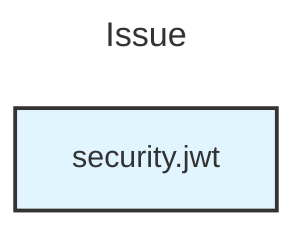
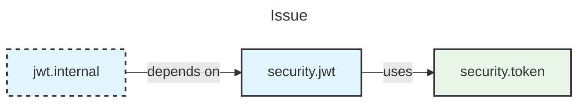
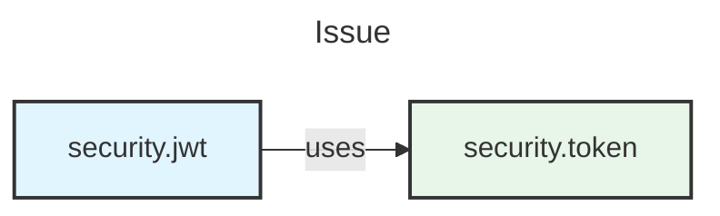

# Diagram Generator - User Story 2

Generates Mermaid component diagrams from GitHub issue analysis results.

## Features

✅ **Consumes Story 1 Output** - Takes JSON from `github_issue_analyzer.py`  
✅ **Top 5 Packages** - Shows most relevant packages by confidence  
✅ **Relationship Inference** - Automatically detects package dependencies  
✅ **Smart Abbreviation** - Shortens long package names for readability  
✅ **Visual Styling** - Color-codes Liberty vs IBM packages  
✅ **Mermaid Syntax** - GitHub-compatible diagram format  

---

## Installation

```bash
# No additional dependencies beyond Story 1
cd /home/dave/Work/Bobathon-2026/src/main/python
```

---

## Usage

### Method 1: Pipe from Story 1

```bash
# Analyze issue and generate diagram in one command
python github_issue_analyzer.py <issue_url> | \
  python -c "import sys, json; print(json.dumps(json.loads(sys.stdin.read())))" | \
  python diagram_generator.py -
```

### Method 2: Save and Load

```bash
# Step 1: Analyze issue and save JSON
python github_issue_analyzer.py https://github.com/OpenLiberty/open-liberty/issues/12345 > analysis.json

# Step 2: Generate diagram from saved JSON
python diagram_generator.py analysis.json
```

### Method 3: Direct JSON Input

```bash
# Pass JSON string directly
python diagram_generator.py '{"packages": [{"name": "io.openliberty.security.jwt", "confidence": 0.95, "package_type": "LIBERTY"}], "issue": {"number": 1, "title": "JWT Issue"}}'
```

### Method 4: Python Library

```python
from diagram_generator import DiagramGenerator
import json

# Load analysis result
with open('analysis.json', 'r') as f:
    analysis = json.load(f)

# Generate diagram
generator = DiagramGenerator()
result = generator.generate_diagram(analysis)

if result.success:
    print(result.mermaid)
else:
    print(f"Error: {result.error_message}")
```

---

## Relationship Inference Rules

The diagram generator automatically infers relationships between packages:

### Rule 1: Internal Dependencies
```
io.openliberty.security.jwt.internal → io.openliberty.security.jwt
(Internal packages depend on public API)
```

### Rule 2: Implementation
```
io.openliberty.cdi.impl → io.openliberty.cdi
(Implementation packages implement interfaces)
```

### Rule 3: Subsystem Relationships
```
io.openliberty.security.jwt → com.ibm.ws.security.token
(JWT uses token subsystem)
```

### Rule 4: Common Prefix
```
io.openliberty.security.jwt → io.openliberty.security.authentication
(Same subsystem packages are related)
```

---

## Output Examples

### Example 1: Single Package

**Input**:
```json
{
  "packages": [
    {"name": "io.openliberty.security.jwt", "confidence": 0.95, "package_type": "LIBERTY"}
  ],
  "issue": {"number": 123, "title": "JWT token validation fails"}
}
```

**Output**:


### Example 2: Multiple Packages with Relationships

**Input**:
```json
{
  "packages": [
    {"name": "io.openliberty.security.jwt", "confidence": 0.95, "package_type": "LIBERTY"},
    {"name": "io.openliberty.security.jwt.internal", "confidence": 0.90, "package_type": "LIBERTY"},
    {"name": "com.ibm.ws.security.token", "confidence": 0.85, "package_type": "IBM"}
  ],
  "issue": {"number": 456, "title": "Token processing error"}
}
```

**Output**:


### Example 3: More Than 5 Packages

**Output**:
```
## 📊 Component Diagram

[Mermaid diagram with top 5 packages]

**Note**: Showing top 5 packages.

### Additional Packages Identified:

- `io.openliberty.config` (confidence: 75%)
- `com.ibm.ws.logging` (confidence: 68%)
- `io.openliberty.monitoring` (confidence: 62%)
```

---

## Styling

### Package Type Colors

- **Liberty packages** (`io.openliberty.*`): Light blue (#e1f5ff)
- **IBM packages** (`com.ibm.ws.*`): Light green (#e8f5e9)
- **Unknown packages**: Light gray (#f5f5f5)

### Special Indicators

- **Internal packages** (`.internal` suffix): Dashed border
- **Implementation packages** (`.impl` suffix): Dashed border

---

## Configuration

### Constants (in `DiagramGenerator` class)

```python
MAX_PACKAGES = 5        # Maximum packages to show in diagram
MAX_LINES = 50          # Maximum lines of Mermaid code
MAX_NAME_LENGTH = 30    # Maximum package name length before abbreviation
```

### Subsystem Relationships

Add custom relationships in `SUBSYSTEM_RELATIONSHIPS`:

```python
SUBSYSTEM_RELATIONSHIPS = {
    'security': ['authentication', 'authorization', 'token'],
    'jwt': ['security', 'token'],
    'jakartasec': ['security', 'authentication'],
    # Add more...
}
```

---

## Integration with Story 3 (Comment Posting)

The diagram output is designed to be embedded in GitHub comments:

```python
from diagram_generator import DiagramGenerator, format_output

# Generate diagram
result = generator.generate_diagram(analysis)

# Format for GitHub comment
comment_body = f"""
## Analysis Results

{format_output(result)}

### Recommendations
- Review the highlighted packages
- Check for recent changes in these components
"""

# Post to GitHub (Story 3)
post_comment(issue_url, comment_body)
```

---

## Error Handling

### No Packages Found

```
❌ Error: No packages identified for diagram generation.
Please ensure the issue description mentions Liberty package names.
```

### Invalid Mermaid Syntax

```
❌ Error: Generated invalid Mermaid syntax
```

### Invalid JSON Input

```
❌ Error: Invalid JSON input: Expecting value: line 1 column 1 (char 0)
```

---

## Testing

### Test with Sample Data

```bash
# Create test JSON
cat > test_analysis.json << 'EOF'
{
  "success": true,
  "packages": [
    {"name": "io.openliberty.security.jwt", "confidence": 0.95, "package_type": "LIBERTY"},
    {"name": "com.ibm.ws.security.token", "confidence": 0.87, "package_type": "IBM"}
  ],
  "issue": {
    "number": 12345,
    "title": "NullPointerException in JWT validation"
  }
}
EOF

# Generate diagram
python diagram_generator.py test_analysis.json
```

### Expected Output

```
## 📊 Component Diagram


```

---

## Performance

- **Generation Time**: <100ms for typical diagrams
- **Memory Usage**: <10MB
- **Max Complexity**: 5 packages, 10 relationships

---

## Limitations

1. **Maximum 5 packages** in diagram (by design for readability)
2. **Relationship inference** is heuristic-based (not perfect)
3. **No circular dependency detection** (shows bidirectional arrows)
4. **Package abbreviation** may lose context for very long names

---

## Future Enhancements

- [ ] Interactive diagram generation (user selects packages)
- [ ] Multiple diagram layouts (LR, TD, RL, BT)
- [ ] Confidence score visualization (node size/opacity)
- [ ] Export to PNG/SVG (requires mermaid-cli)
- [ ] Custom relationship rules via config file

---

## Troubleshooting

### Diagram Not Rendering in GitHub

**Problem**: Mermaid syntax not rendering  
**Solution**: Ensure you're using GitHub's markdown preview or README files

### Package Names Too Long

**Problem**: Abbreviated names unclear  
**Solution**: Adjust `MAX_NAME_LENGTH` constant or use full names

### No Relationships Shown

**Problem**: Packages appear disconnected  
**Solution**: Add custom relationships in `SUBSYSTEM_RELATIONSHIPS`

---

## Contributing

See main [CONTRIBUTING.md](../../CONTRIBUTING.md) for guidelines.

---

## License

Part of the Bobathon 2026 project.