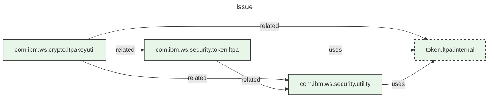

## 📊 Component Diagram

```mermaid
---
title: Issue #1 - Update OpenLiberty ltpa token processing to handle PQC algor
---
graph LR
    A[com.ibm.ws.crypto.ltpakeyutil]
    B[com.ibm.ws.security.token.ltpa]
    C[com.ibm.ws.security.utility]
    D[token.ltpa.internal]
    A -->|related| B
    A -->|related| C
    A -->|related| D
    B -->|related| C
    B -->|uses| D
    C -->|uses| D
    style A fill:#e8f5e9,stroke:#333,stroke-width:2px
    style B fill:#e8f5e9,stroke:#333,stroke-width:2px
    style C fill:#e8f5e9,stroke:#333,stroke-width:2px
    style D fill:#e8f5e9,stroke:#333,stroke-width:2px,stroke-dasharray: 5 5
```
